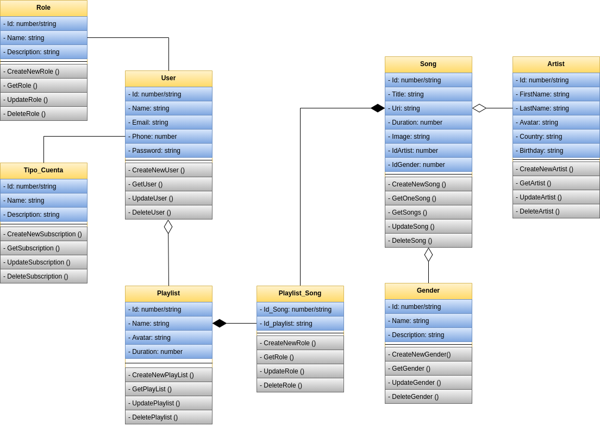

# Titulo: SpotPlay
---
## Overview: 
Spotplay es una nueva compañía de música online que tiene como objetivo proporcionar mejores relaciones con los artistas y fans.

Su producto es Spotplay, una plataforma en la que las personas pueden generar listas de reproducción para sus artistas favoritos y gustos musicales.

### Alcance(Scope)

- La aplicacion tendra acceso para usuarios cunsumidores, a traves de su registro.
- La aplicacion tendra acceso para usuarios editores, para dar mantenimietno a la aplicacion.
- La aplicacion tendra la facilidad de crear listas de canciones segun los gustos del usuario.

#### Casos de uso

* El usuario lector puede crear una nueva lista con un nombre dado.
* El usuario lector puede cambiar el nombre de una lista.
* El usuario lector puede obtener una cancion .
* El usuario lector puede obtener las listas de reporduccion.
* El usuario lector puede tener una cuenta basica o premium.
* EL usuairo con cuenta basica tiene anuncios.
* El usuario con cuenta premium no cuenta con anuncios.

#### Out of Scope (casos de uso No Soportados)

* El usuario no puede acceder con cuentas de tercero(google,facebook etc.)
* El usuario no puede registrarse sin una contaseña valida.
* El usuario no puede comptartir lista de canciones.
* El usuario no puede tener una lista de canciones favoritas.

---
## Arquitectura

### Diagramas
Diagrama de clases

Diagrama de secuencia

Diagrama de casos de uso

poner diagramas de secuencia, uml, etc

### Modelo de datos
Poner diseño de entidades, Jsons, tablas, diagramas entidad relación, etc..

---
## Limitaciones
Lista de limitaciones conocidas. Puede ser en formato de lista.
Ej.
* Llamadas del API tienen latencia X
* No se soporta mas de X llamadas por segundo
---
## Costo
Descripción/Análisis de costos
Ejemplo:
"Considerando N usuarios diarios, M llamadas a X servicio/baseDatos/etc"
* 1000 llamadas diarias a serverless functions. $XX.XX
* 1000 read/write units diarias a X Database on-demand. $XX.XX
Total: $xx.xx (al mes/dia/año)